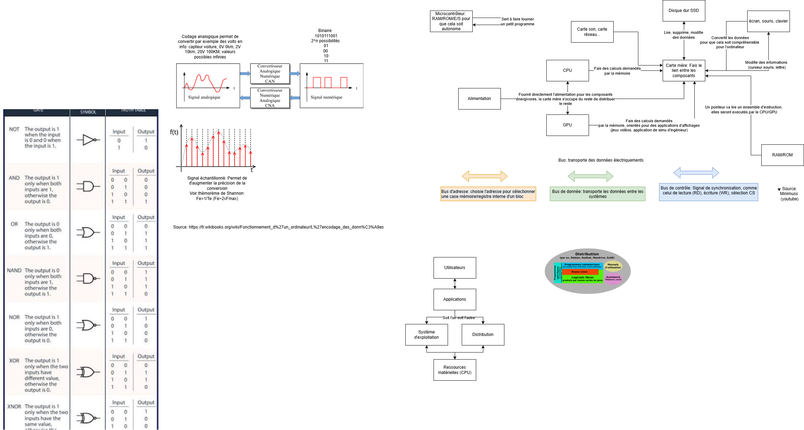

Ce dossier contient des explications hardware

# Ordinateur

# Communication

# Signal et porte logique

# Les OS 

# Schéma final

# Source

Fonctionnement matériel informatique:
https://fr.wikibooks.org/wiki/Fonctionnement_d%27un_ordinateur/L%27encodage_des_donn%C3%A9es

Les systèmes d'exploitation (schéma):
https://fr.wikipedia.org/wiki/Distribution_informatique

Schéma:
https://www.google.com/url?sa=t&source=web&rct=j&url=https%3A%2F%2Fwww.researchgate.net%2Ffigure%2FPortes-logiques-classiques_fig42_350521248&ved=0CBYQjRxqFwoTCOjYuvvnhJYDFQAAAAAdAAAAABBG&opi=89978449