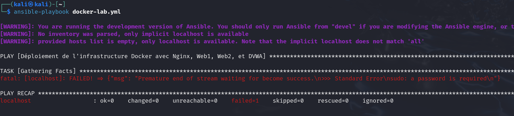
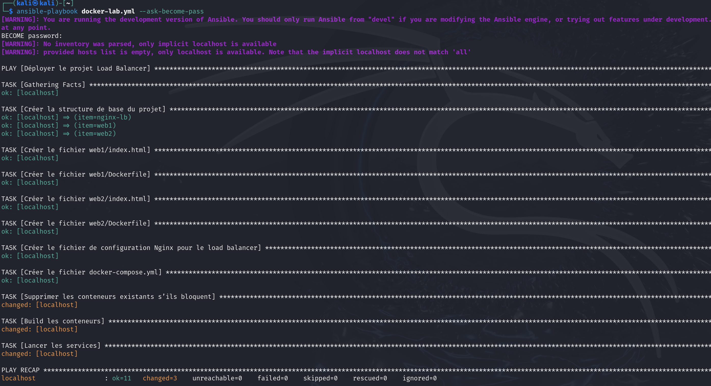
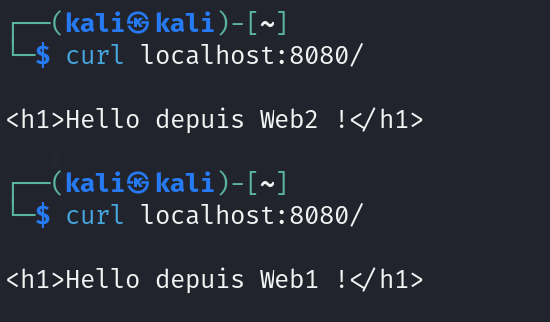
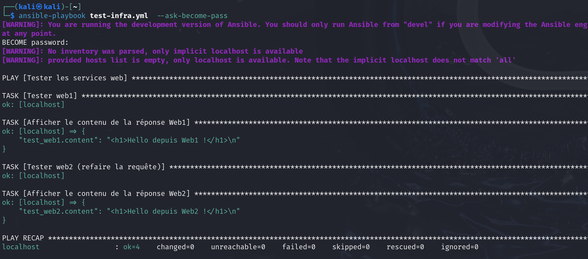
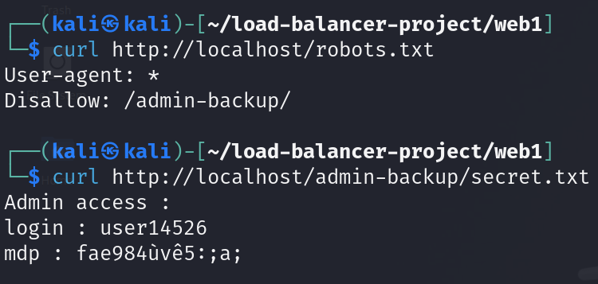

## Install dépendances

```bash
sudo apt install docker.io
sudo apt install docker-compose
```

## Structure shell

 ```linuyx
 load-balancer-project/
├── docker-compose.yml
├── nginx-lb/
│   ├── default.conf
├── web1/
│   ├── Dockerfile
│   └── index.html
│   └── robots.txt	
├── web2/
│   ├── Dockerfile
│   └── index.html
```

## Créer des dossiers


Crée un dossier pour ton projet :

```bash
mkdir docker-load-balancer && cd docker-load-balancer
mkdir web1 && mkdir web2
```


Voici un exemple de fichier **`docker-compose.yml`** qui simule le comportement par défaut d’un **load balancer** (équilibreur de charge) en utilisant **NGINX** comme reverse proxy, avec plusieurs instances d’une application web en backend :

```yaml
version: '3'

services:
  web1:
    build: ./web1
    container_name: web1
    expose:
      - "80"

  web2:
    build: ./web2
    container_name: web2
    expose:
      - "80"

  nginx-lb:
    image: nginx:alpine
    container_name: load_balancer
    ports:
      - "8080:80"
    volumes:
      - ./nginx-lb/default.conf:/etc/nginx/conf.d/default.conf
    depends_on:
      - web1
      - web20"

```

Et voici un fichier **`nginx-lb/default.conf`** associé, à placer dans le même répertoire que le `docker-compose.yml`, qui fait du round-robin (par défaut) entre les deux backends :

```nginx
events {}

http {
    upstream backend {
        server web1:80;
        server web2:80;
    }

    server {
        listen 80;

        location / {
            proxy_pass http://backend;
        }
    }
}

```

**web1/Dockerfile**

```bash
FROM nginx:alpine
COPY index.html /usr/share/nginx/html/index.html
```
# Build avec ansible

* Pour répondre aux besoins du prof, il faut adapter le script bash avec un build ansible, le ficheir sera nommé **docker-lab.yml** :

```yaml
- name: Déployer le projet Load Balancer
  hosts: localhost
  become: true
  vars:
    base_dir: "/home/kali/load-balancer-project"

  tasks:

    - name: Créer la structure de base du projet
      file:
        path: "{{ base_dir }}/{{ item }}"
        state: directory
      loop:
        - nginx-lb
        - web1
        - web2

    - name: Créer le fichier web1/index.html
      copy:
        dest: "{{ base_dir }}/web1/index.html"
        content: |
          <h1>Hello depuis Web1 !</h1>

    - name: Créer le fichier web1/Dockerfile
      copy:
        dest: "{{ base_dir }}/web1/Dockerfile"
        content: |
          FROM nginx:alpine
          COPY index.html /usr/share/nginx/html/index.html

    - name: Créer le fichier web2/index.html
      copy:
        dest: "{{ base_dir }}/web2/index.html"
        content: |
          <h1>Hello depuis Web2 !</h1>

    - name: Créer le fichier web2/Dockerfile
      copy:
        dest: "{{ base_dir }}/web2/Dockerfile"
        content: |
          FROM nginx:alpine
          COPY index.html /usr/share/nginx/html/index.html

    - name: Créer le fichier de configuration Nginx pour le load balancer
      copy:
        dest: "{{ base_dir }}/nginx-lb/default.conf"
        content: |
          upstream backend {
              server web1:80;
              server web2:80;
          }

          server {
              listen 80;
              location / {
                  proxy_pass http://backend;
              }
          }

    - name: Créer le fichier docker-compose.yml
      copy:
        dest: "{{ base_dir }}/docker-compose.yml"
        content: |
          version: '3'

          services:
            web1:
              build: ./web1
              container_name: web1
              expose:
                - "80"

            web2:
              build: ./web2
              container_name: web2
              expose:
                - "80"

            nginx-lb:
              image: nginx:alpine
              container_name: load_balancer
              ports:
                - "8080:80"
              volumes:
                - ./nginx-lb/default.conf:/etc/nginx/conf.d/default.conf
              depends_on:
                - web1
                - web2

    - name: Build les conteneurs
      command: docker-compose build
      args:
        chdir: "{{ base_dir }}"

    - name: Lancer les services
      command: docker-compose up -d
      args:
        chdir: "{{ base_dir }}"

```

* Build le paquet avec ansible : 

```bash
ansible-playbook docker-lab.yml
```



* Problème de droit, pour y remédier : 

```bash
ansible-playbook docker-lab.yml --ask-become-pass
```

* Voici le scritp réussi après + de 3h de debug : 



* Tester le load balancer :



Pour tester le fichier  **tester-infra.yml** : 

```yaml
---
- name: Tester les services web
  hosts: localhost
  gather_facts: no

  tasks:
    - name: Tester web1
      uri:
        url: http://localhost:8080
        return_content: yes
      register: test_web1

    - name: Afficher le contenu de la réponse Web1
      debug:
        var: test_web1.content

    - name: Tester web2 (refaire la requête)
      uri:
        url: http://localhost:8080
        return_content: yes
      register: test_web2

    - name: Afficher le contenu de la réponse Web2
      debug:
        var: test_web2.content
```

* Tester l'infra :

```bash
ansible-playbook test-infra.yml  --ask-become-pass 
```



## En plus : création d'un dossier robots.txt

Pour ce faire : **`vim /home/kali/load-balancer-project/web1/robots.txt`**

```robots.txt
User-agent: *
Disallow: /admin-backup/
```

Qui fera un lien avec un dossier caché : 

```bash
mkdir /var/www/html/admin-backup
echo "Ceci est un fichier sensible" > /var/www/html/admin-backup/secret.txt
```

Pour tester :

```bash
└─$ curl localhost/robots.txt
User-agent: *
Disallow: /admin-backup/

curl http://localhost/admin-backup/secret.txt
```



[Tout est ok dans l'infra, maintenant place au pentest !](Partie_pentest.md)

